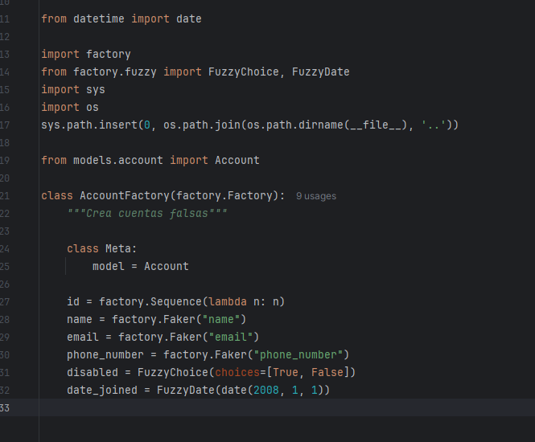

# ACTIVIDAD 9
## Creacion del entorno virtual python
```bash
python3 -m venv venv
source venv/bin/activate
```
## Instalando dependencias

```bash
pip install -r requirements.txt
```
## Ejecutar todas las pruebas
```bash
make test_all
```

## Ejecutar pruebas con cobertura
```bash
make coverage_individual
```
# ACTIVIDAD: Aserciones_Pruebas


# ACTIVIDAD: coverage_pruebas

**Documentar las observaciones:** No se han encontrado pruebas con coverturas menores que 100%.
```
Ejecuta nuevamente make test y make coverage_individual para verificar que el nuevo método está completamente cubierto por pruebas.
```


# ACTIVIDAD: factories_fakes





'''
Resultados despues de verificar los tests:
'''


# ACTIVIDAD: mocking_objetos

### test_movie_reviews_failure:

### test_movie_ratings_failure:


## Resultados:


# ACTIVIDAD: practica_tdd

### test_update_counter_failure


## Resultados:


# ACTIVIDAD: pruebas_fixtures


## Resultados:


# ACTIVIDAD: pruebas_pytest

## Resultados:


```
pytest -v
```


**Explicación breve de la actividad:**
Aserciones:La parte de aserciones se implementó cada vez que se verifican las salidas o statements de los metodos de una clase en python.
Fixtures: Los fixtures automatizaron la configuración inicial y limpieza posterior en cada prueba ejecutada usando bases de datos.
Factories/Fakes: Se implementó factories para generar datos de prueba aleatorios para conseguir un gran volumen de datos para las pruebas.
Coverage: Utilicé coverage al medir qué líneas ejecutaban mis tests, logrando así cobertura total.
Mocking: Usé mocks para simular respuestas externas sin depender de servicios reales durante los tests.
TDD: Seguí el ciclo TDD escribiendo primero tests fallidos que luego fuí implementando código y refactorizando, para que tenga mismo comportamiento, pero mejor estructura.
